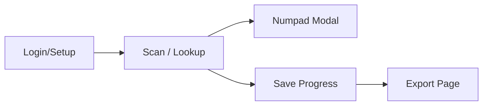

Here’s a **frontend design summary** you can copy directly into a visual builder like **Google Stitch**, **V0.dev**, or **Figma-to-Code tools** — optimized for your **RF Inventory Counting Web App** MVP.

---

## 📱 **RF Inventory Counting Web App – Frontend Design Summary**

### 🧩 **Overall Concept**

A mobile-friendly **progressive web app (PWA)** for warehouse staff to:

* Scan or enter **bin barcodes** (Code-128)
* View items in each bin from a CSV data source
* Confirm or correct inventory quantities
* Save progress locally (for partial counts)
* Export updated data as CSV

---

## 🎨 **UI Structure**

### 1️⃣ **Login / Setup Page**

Purpose: Load the initial stock list (CSV) and resume a saved session.

**Elements:**

* 📁 File upload field: “Upload Stock CSV”
* 🧮 Optional input: “Starting Bin” (text input)
* 🔄 Button: “Resume Previous Session”
* ✅ Button: “Start New Count”

**Notes:**

* When CSV is uploaded, parse and store data in local storage (`indexedDB` or `localStorage`).
* Show total number of bins and items loaded.

---

### 2️⃣ **Scan / Lookup Page**

Purpose: Main screen for scanning or manually entering bin codes.

**Elements:**

* 📷 “Scan Barcode” button (camera access)
* 🔢 Manual entry field: “Enter Bin Code”
* 🔍 Search field (optional): lookup by item code or description
* 🧭 Display scanned bin + item list below

**Item Table Columns:**
| Item Code | Description | Expected Qty | Counted Qty | ✅ / ❌ |

Each row has:

* Item Code (bold)
* Description (small gray text)
* Expected Qty (right-aligned)
* Editable “Counted Qty” field
* Buttons: ✅ (confirm same qty), ❌ (open numpad)

---

### 3️⃣ **Numpad Modal (Popup)**

Purpose: Appears when ❌ pressed to enter a corrected quantity.

**Elements:**

* Display: “Editing Item: [ItemCode]”
* Big numeric keypad (0–9, Clear, Enter)
* ✅ Confirm button

---

### 4️⃣ **Progress Tracker Bar**

Persistent at the bottom of the screen:

* “Bins Counted: X / Y”
* “Unsynced Changes: N”
* “Save Progress” button

---

### 5️⃣ **Local Cache Logic**

* Data is **auto-saved** in `localStorage` after each update.
* If browser is closed, progress is reloaded from cache.
* A “Clear Session” button is available in Settings.

---

### 6️⃣ **Export Page**

Purpose: Export finished work as updated CSV.

**Elements:**

* Table summary (e.g. 20 bins complete, 3 remaining)
* Buttons:

  * 📤 “Export Updated CSV”
  * 🔄 “Continue Counting”
  * 🗑 “Reset & Start Over”

---

## 🧱 **Page Flow**

---

## ⚙️ **Technical Notes**

| Function         | Implementation                                                |
| ---------------- | ------------------------------------------------------------- |
| CSV Parsing      | Use PapaParse or built-in FileReader                          |
| Local Storage    | IndexedDB (better for large CSVs)                             |
| Barcode Scanning | Use `jsQR` or `QuaggaJS` (browser camera)                     |
| UI Framework     | React + Tailwind (ideal for mobile)                           |
| Export CSV       | Convert JSON → CSV (e.g. with `papaparse.unparse()`)          |
| Hosting          | Flask backend on your Ubuntu VPS (serving static React build) |

---

## 💾 **Expected CSV Columns**

Your CSV should include at least:

| BinCode | ItemCode | Description | QtyInStock |
| ------- | -------- | ----------- | ---------- |

During counting, you’ll add:
| CountedQty | LastUpdated |

---

## 🚀 **Next Steps**

1. Scaffold frontend using **React** or **V0.dev**.
2. Implement local CSV upload → JSON state parser.
3. Build the **Scan / Lookup** view and item list.
4. Add local save + re-export as CSV.
5. Connect to your **Ubuntu Flask backend** for persistence and optional user login later.